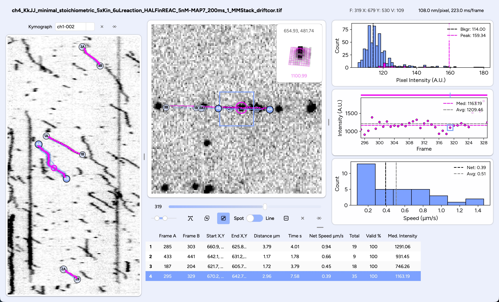

## Tracy (Beta)

> **Note:** Tracy is currently in **beta** — features and workflows may change regularly.



---

### Table of Contents

1. [Installation](#installation)
2. [Getting Started](#getting-started)

   1. [Launching Tracy](#launching-tracy)
   2. [Loading Your Movie](#loading-your-movie)
   3. [Browsing Spots](#browsing-spots)
   4. [Generating Kymographs](#generating-kymographs)
   5. [Generating Trajectories](#generating-trajectories)
   6. [Browsing Trajectories](#browsing-trajectories)
3. [Additional Features](#additional-features)

   * [Drift Correction](#drift-correction)
   * [Colocalization](#colocalization)
   * [Step Finding](#step-finding)
   * [Reference Image](#reference-image)
   * [Custom Columns](#custom-columns)
   * [Color by Value](#color-by-value)
4. [Saving & Loading](#saving--loading)

   * [Save Trajectories](#save-trajectories)
   * [Load Trajectories](#load-trajectories)
   * [Import TrackMate Data](#import-trackmate-data)
5. [License](#license)

---

## Installation <a name="installation"></a>

Install Tracy with your terminal:

```bash
# Create and activate a dedicated environment
conda create -n tracy python=3.10 -y
conda activate tracy

# Install Tracy
pip install tracyspot
```

> *Tip:* On Windows, you can download Anaconda and use the Anaconda Prompt as your terminal.

---

## Getting Started <a name="getting-started"></a>

### 1. Launching Tracy <a name="launching-tracy"></a>

```bash
conda activate tracy       # if not already active
pip install tracyspot --upgrade   # update during beta
tracy &                    # run in the background
```

> *Note:* The first launch may take a few seconds.

### 2. Loading Your Movie <a name="loading-your-movie"></a>

1. Click **Load Movie** (or use **Load » Movie**).
2. Select a single- or multi-channel TIFF movie.
3. If necessary, enter pixel size and frame interval when prompted.
4. Pan by holding down the middle button (or Ctrl/Cmd) and dragging, zoom with the mouse wheel.
5. If available, switch channels by clicking the channel label (shortcut: `1`, `2`, …).
6. Toggle the maximum projection with the button below the movie (shortcut: `m`).
7. Adjust the contrast using the slider.

### 3. Browsing Spots <a name="browsing-spots"></a>

1. Click on the movie to detect a spot at the click location.

   * **Blue square:** search region.
   * **Magenta circle:** fitted spot (radius = 2σ).
2. Hover over the inset to view a 3D fit (scroll to zoom, drag to rotate).
3. Hold `r` + scroll (or use **Spot » Search Radius**) to adjust the search radius.
4. Navigate frames with the slider under the movie.

> The **spot histogram** shows intensities in the search area and highlights values in the spot.

### 4. Generating Kymographs <a name="generating-kymographs"></a>

1. Switch to **Line** mode (slider under movie or `n`).
2. (Optional) Toggle max‑projection (`m`) to guide line placement or load a [reference image](#reference-image).
3. Draw a segmented line by clicking anchors (press `Esc` to cancel).
4. Double‑click to finish and generate the kymograph.
5. For multi‑channel movies, a kymograph is generated for each channel (toggle with `1`, `2`, …).
6. Cycle through kymographs with `,` (previous) and `.` (next).

> *Tip:* Apply a LoG filter via **Kymograph » Apply LoG filter** for clearer tracks (applies to subsequent kymographs).

### 5. Generating Trajectories <a name="generating-trajectories"></a>

#### A. From a Kymograph

1. On the kymograph, draw a segmented line (blue anchors) to follow the track.
2. Double‑click to finish and compute a trajectory using your search radius and tracking mode (see [tracking options](#tracking-options)).
3. Click any kymograph or plot point to jump to that spot; use `→`/`←` to step forward and backward.
4. Press spacebar to animate the trajectory.
5. If you want to recalculate the trajectory with new tracking options, press `Enter` (or **Trajectory » Recalculate**).
6. (Optional) Fill gaps via **Kymograph » Connect Spot Gaps**.

> Trajectories are displayed on kymographs dynamically, so overlapping kymographs may share trajectories.

#### B. Direct Movie Tracking

1. Click an initial spot on the movie.
2. Skip a few frames and click the next spot. Repeat until the track is covered.
3. End a click sequence with `Enter` or cancel with `Esc`.
4. Browse/select tracks as above.
5. If you want to recalculate the trajectory with new [tracking options](#tracking-options), press `Enter` (or **Trajectory » Recalculate**).

> You can use “video‑game” controls: `w`/`a`/`s`/`d` to move the cursor, `l`/`j` to change frames, `k` to select the spot.

#### Tracking Options <a name="tracking-options"></a>

* **Search Radius:** adjust with `r` + scroll
* **Tracking Mode** (`t`)**:**

  * **Independent** (default)**:** fits each frame independently.
  * **Tracked:** uses previous frame’s spot as center.
  * **Smooth:** independent + post‑filter outliers.
* Tracking options are set for any subsequent analysis. An existing trajectory can be recalculated using the currently set options by pressing `Enter` (or **Trajectory » Recalculate**).
* If a spot looks wrong, you can invalidate it with `x` when it's highlighted.
* Avoid using spots in existing tracks via **Spot » Avoid previous spots**.

---

## Plots <a name="plots"></a>

* **Intensity Plot:** integrated spot intensity at each frame.
* **Speed Histogram:** frame‑to‑frame speeds with the net speed overlayed (i.e. only considering start and end position).

---

## Browsing Trajectories <a name="browsing-trajectories"></a>

* New trajectories append to the **Trajectory Table**.
* Click trajectories in the table or use the arrow keys (**`↑`**, **`↓`**). Right‑click for options (e.g., Go to kymograph).
* Delete a trajectory with `Backspace`.

---

## Additional Features <a name="additional-features"></a>

### Drift Correction <a name="drift-correction"></a>

1. Identify a stationary reference spot that can be found in most frames.
2. Click it and ensure it is found (i.e. a magenta circle appears). It does not matter which frame you choose.
3. Use **Movie » Correct Drift** to track it from start‑to‑end and apply the frame shifts.
4. Review and save if satisfactory.

### Colocalization <a name="colocalization"></a>

* Determines colocalization if a spot exists within 4 pixels in the other channel.
* Toggle under **Spot » Colocalization** for multi‑channel movies.
* Existing trajectories prompt analysis
* Results appear as new table columns.

### Step Finding <a name="step-finding"></a>

* Calculates steps in the intensity profile.
* Enable **Trajectory » Calculate Steps**.
* Adjust rolling‑average window and minimum step size.
* Existing trajectories prompt analysis.
* Results appear as steps in the **Intensity Plot**.
* Detected steps and sizes are saved in **Per‑Trajectory** sheet; each point’s step ID in **Data Points**.

### Reference Image <a name="reference-image"></a>

* Useful for overlaying filaments or guides during kymograph creation.
* Load via **Load » Reference Image**
* Toggle with the icon under the movie.
* While toggled, use shift+arrows to move the reference image if necessary

### Custom Columns <a name="custom-columns"></a>

* Right‑click any column header or use **Trajectories » Add Column**.

  * **Binary:** Yes/No flags.
  * **Value:** any numeric/text value.
* Assign via right‑click on table row or kymograph label.

### Color by Value <a name="color-by-value"></a>

* If custom column or colocalization data exists, under **Trajectories » Color By** choose binary, value, or colocalization.

---

## Saving & Loading <a name="saving--loading"></a>

### Save Trajectories <a name="save-trajectories"></a>

* **Save » Trajectories** exports an Excel workbook with four sheets:

  1. **Data Points**: per-frame spot measurements along each trajectory.
  2. **Per‑Trajectory**: one-row summary statistics for each trajectory.
  3. **Per‑Kymograph**: aggregates grouped by kymograph/ROI (geometry).
  4. **Aggregate analysis**: a single-row summary across the whole movie.

---

#### Sheet: Data Points

Each row is one frame from one trajectory.

##### Columns

* **Trajectory**: trajectory ID.
* **Channel**: movie channel the trajectory was tracked in.
* **Frame**: 1-indexed frame number.
* **Original Coordinate X / Y**: the original (raw) coordinate for that frame.
* **Search Center X / Y**: the search center used for tracking in that frame.
* **Spot Center X / Y**: fitted spot center for that frame (blank if fit failed).
* **Intensity**: integrated spot intensity (blank if invalid/missing).
* **Sigma**: fitted spot σ (blank if fit failed).
* **Peak**: fitted peak amplitude (blank if fit failed).
* **Background from trajectory**: `Yes` if a fixed background was used for the trajectory, else `No`.
* **Background**: per-frame background estimate (blank if not computed).
* **Speed (px/frame)**: frame-to-frame speed in pixels.
* **Speed (μm/s)** / **Speed (μm/min)**: speed converted using pixel size + frame interval (blank if either is missing).

##### Optional columns: step finding

> Only present if step-finding is enabled and steps exist.

* **Step Number**: step segment index for that frame.
* **Step Intensity Value**: median intensity for that step segment.
* **Step Intensity Value (background-adjusted)**: step median minus the per-frame background (when available).

##### Optional columns: colocalization

> Only present for multi-channel movies when colocalization is enabled.

* **Colocalized w/any channel**: `Yes`/`No` per frame (blank if not evaluated).
* **Colocalized w/ch1**, **Colocalized w/ch2**, …: `Yes`/`No` per frame for each channel (the reference channel column is left blank).

---

#### Sheet: Per‑Trajectory

Each row is one trajectory.

##### Columns

* **Movie**: movie file name.
* **Trajectory**: trajectory ID.
* **Channel**: channel the trajectory was tracked in.
* **Start Frame / End Frame**: 1-indexed start/end frames.
* **Anchors**: JSON list of anchor points used to define the kymograph track line (frame index + x/y in px; frame index is Tracy’s internal frame index).
* **ROI**: JSON description of the kymograph ROI geometry.
* **Total Points**: number of frames in the trajectory.
* **Valid Points**: number of frames with a valid intensity (>0).
* **Percent Valid**: `100 * Valid Points / Total Points`.
* **Search Center X Start / Y Start**: starting search center coordinate.
* **Search Center X End / Y End**: ending search center coordinate.
* **Distance (μm)**: straight-line displacement from start→end converted to μm (blank if pixel size missing).
* **Time (s)**: duration from start→end in seconds (blank if frame interval missing).
* **Background**: fixed trajectory background value (blank if not used).
* **Average Intensity**: mean intensity over valid points.
* **Median Intensity**: median intensity over valid points.
* **Net Speed (px/frame)**: straight-line displacement / (end-start frames).
* **Net Speed (μm/s)** / **Net Speed (μm/min)**: net speed converted using pixel size + frame interval (blank if either is missing).
* **Avg. Speed (px/frame)**: mean of per-frame speeds.
* **Avg. Speed (μm/s)** / **Avg. Speed (μm/min)**: average speed converted (blank if either is missing).

##### Optional columns: step finding

> Only present if step-finding is enabled and steps exist.

* **Number of Steps**
* **Average Step Size**: average absolute difference between consecutive step medians.
* **Average Step Size w/Step to Background**: as above, but also includes the final step-to-background difference when a fixed background exists.

##### Optional columns: custom columns

> Only present if you added custom columns in the UI.

* Custom columns appear as **`<Name> [binary]`** or **`<Name> [value]`** depending on the column type.

##### Optional columns: colocalization summary columns

> Only present for multi-channel movies when colocalization columns exist.

* **Ch. 1 co. %**, **Ch. 2 co. %**, …: percent of frames colocalized with each other channel.
  * For 2-channel movies, the non-reference channel column is the overall colocalization percent.
  * For >2 channels, each non-reference column is computed separately per target channel.
  * The reference channel’s own **Ch. X co. %** cell is left blank.

---

#### Sheet: Per‑Kymograph

Each row is one ROI geometry (kymograph).

##### Columns

* **ROI**: ROI JSON (same format as in Per‑Trajectory).
* **Total distance (μm)**: total polyline length of the ROI in μm (blank if pixel size missing).
* **Total time (s)**: total movie duration in seconds (blank if frame interval missing).
* **Number of trajectories**: trajectories whose ROI matches this ROI JSON.
* **Events (/min)**: `Number of trajectories / (Total time in minutes)` (blank if frame interval missing).
* **Events (/μm/min)**: `Events (/min) / Total distance (μm)` (blank if pixel size or frame interval missing).
* **Average net speed (μm/s)**: mean **Net Speed (μm/s)** across trajectories in this ROI.
* **Average average speed (μm/s)**: mean **Avg. Speed (μm/s)** across trajectories in this ROI.
* **Average run length (μm)**: mean **Distance (μm)** across trajectories in this ROI.
* **Average run time (s)**: mean **Time (s)** across trajectories in this ROI.
* **Average median intensity**: mean **Median Intensity** across trajectories in this ROI.
* **Average average intensity**: mean **Average Intensity** across trajectories in this ROI.

---

#### Sheet: Aggregate analysis

A single row summarizing the whole movie.

##### Columns

* **Pixel size (nm/px)**: pixel size used for unit conversions (blank if unknown).
* **Frame time (ms)**: frame interval used for unit conversions (blank if unknown).
* **Total movie frames**
* **Total time (s)**: total movie duration (blank if frame time unknown).
* **Movie dimensions (px)**: `width, height`.
* **Movie dimensions (μm)**: `width, height` converted using pixel size (blank if unknown).
* **Total kymographs**: number of ROI geometries (see multi-channel caveat below).
* **Total kymograph distance (μm)**: sum of all ROI lengths (includes empty ROIs; blank if pixel size unknown).
* **Empty kymographs**: ROIs with zero trajectories.
* **Number of trajectories**
* **Number of events (/min)**: total trajectories per total movie time in minutes (blank if frame time unknown).
* **Number of events (/μm/min)**: events per minute divided by total kymograph distance (blank if pixel size or frame time unknown).
* **Average net speed (μm/s)**, **Average average speed (μm/s)**, **Average run length (μm)**, **Average run time (s)**,
  **Average median intensity**, **Average average intensity**: means across all trajectories, regardless of ROI.

---

#### Caveats (especially important for multi-channel movies)

* **Per‑Kymograph and Aggregate “kymograph” counts are ROI-based, not per-channel.** In multi-channel movies, Tracy draws a kymograph for each channel from the same ROI geometry, but the export currently groups by ROI geometry only. That means:
  * **Total kymographs** counts ROI geometries (not `ROI × channels`).
  * **Per‑Kymograph** rows are ROI geometries (not separate rows per channel).
* **Overlapping ROIs / shared trajectories:** if the same trajectory is associated with multiple ROIs/kymographs, the **Per‑Kymograph** sheet can double-count trajectories and bias the averages.

### Load Trajectories <a name="load-trajectories"></a>

* Load `.xlsx` files with the above sheets or similar formats (requires columns: Trajectory, Channel, Frame, Search Center X, Search Center Y).
* Use **Kymograph » Draw from Trajectories** to redraw embedded lines.

### Import TrackMate Data <a name="import-trackmate-data"></a>

* Load `.csv` from TrackMate (spot file) via **Load Trajectories**; uses `TRACK_ID`, `FRAME`, `POSITION_X`, `POSITION_Y` to perform a search.

---

## License <a name="license"></a>

This project is released under the MIT License — see [LICENSE.txt](https://github.com/sami-chaaban/tracy/blob/main/LICENSE.txt).
